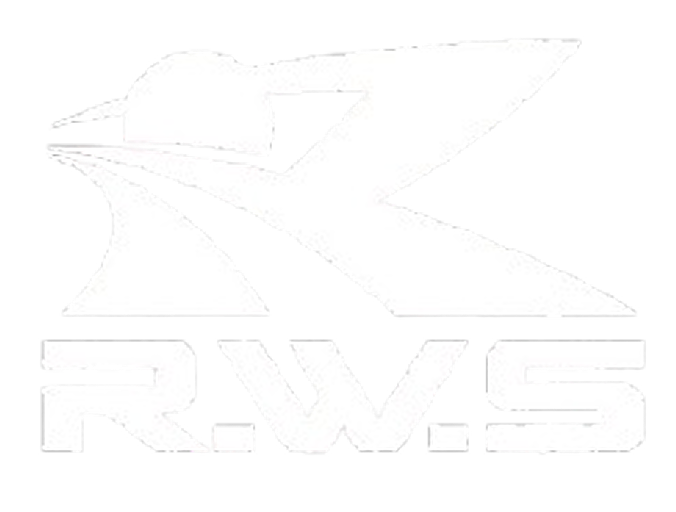
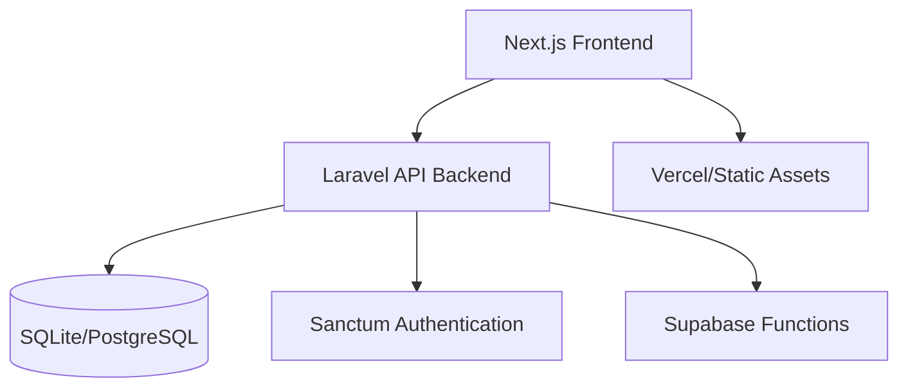

# R.W.S Blog System

<div align="center">



**Modern, Scalable Blog Platform with Separated Frontend and Backend Architecture**

[](https://nextjs.org/)
[](https://laravel.com/)
[](https://www.typescriptlang.org/)
[](https://supabase.com/)
[](https://tailwindcss.com/)

</div>

## 🚀 Project Overview

R.W.S Blog System is a modern, production-ready blog platform built with a completely separated frontend and backend architecture. This design enables independent scaling, deployment flexibility, and the potential for multi-platform support.

### 🏗️ Architecture



**Frontend**: Next.js 15 with TypeScript, Server Components, and shadcn/ui  
**Backend**: Laravel 12 with PHP 8.2, Sanctum authentication, and SQLite  
**Deployment**: Vercel (Frontend) + Supabase Functions (Backend)  
**Architecture**: API-first, fully decoupled, cloud-native

## ✨ Key Features

### 🔐 **Enterprise-Grade Security**
- Laravel Sanctum SPA authentication with JWT tokens
- CSRF protection and XSS prevention
- Content Security Policy (CSP) implementation
- Rate limiting and request validation
- SQL injection protection via Eloquent ORM

### 📝 **Content Management**
- **Public Interface**: Homepage, post listings, individual post pages, search
- **Admin Dashboard**: Full CRUD operations for posts
- **Rich Editor**: Markdown support with live preview
- **Draft System**: Save and publish workflow
- **Search & Filter**: Multi-field search across title, content, and excerpt

### 🎨 **Modern UI/UX**
- Responsive design with Tailwind CSS
- Dark/Light mode support
- Server-side rendering for SEO optimization
- Optimized image loading with Next.js Image
- Component-based architecture with shadcn/ui

### 🚀 **Performance & Scalability**
- Next.js App Router with Server Components
- Database query optimization
- Caching strategies for improved performance
- CDN integration for static assets
- Edge function deployment support

## 📋 Prerequisites

- **Node.js**: v20.0.0 or higher
- **PHP**: v8.2 or higher
- **Composer**: Latest version
- **SQLite**: v3.8 or higher (or PostgreSQL for production)
- **Git**: Latest version

## 🛠️ Installation & Setup

### 1. Clone the Repository

```bash
git clone https://github.com/your-username/RWS.git
cd RWS
```

### 2. Backend Setup (Laravel)

```bash
cd backend

# Install PHP dependencies
composer install

# Copy environment file
cp .env.example .env

# Generate application key
php artisan key:generate

# Create SQLite database
touch database/database.sqlite

# Run database migrations
php artisan migrate

# Seed the database (optional)
php artisan db:seed

# Install Node.js dependencies for development
npm install
```

### 3. Frontend Setup (Next.js)

```bash
cd ../frontend

# Install dependencies
npm install

# Copy environment file
cp .env.example .env.local

# Configure environment variables
# Edit .env.local with your backend API URL
```

### 4. Environment Configuration

#### Backend (.env)
```env
APP_NAME="R.W.S Blog"
APP_ENV=local
APP_KEY=base64:your-generated-key
APP_DEBUG=true
APP_URL=http://localhost:8000

DB_CONNECTION=sqlite
DB_DATABASE=/absolute/path/to/database.sqlite

SANCTUM_STATEFUL_DOMAINS=localhost:3000,127.0.0.1:3000
SESSION_DOMAIN=localhost
```

#### Frontend (.env.local)
```env
NEXT_PUBLIC_API_URL=http://localhost:8000/api
NEXT_PUBLIC_APP_NAME="R.W.S Blog"
NEXT_PUBLIC_SITE_URL=http://localhost:3000
```

## 🚀 Development Workflow

### Start Development Servers

#### Option 1: All Services (Recommended)
```bash
# From backend directory
composer dev
# This starts: Laravel server, queue worker, logs, and Vite

# From frontend directory (separate terminal)
npm run dev
```

#### Option 2: Individual Services
```bash
# Backend only
cd backend
php artisan serve

# Frontend only
cd frontend
npm run dev
```

### 📝 Development URLs

- **Frontend**: http://localhost:3000
- **Backend API**: http://localhost:8000/api
- **Admin Dashboard**: http://localhost:3000/admin

### 🧪 Testing

#### Backend Tests
```bash
cd backend
php artisan test
# or
composer test
```

#### Frontend Tests
```bash
cd frontend

# Unit tests
npm run test

# E2E tests
npm run test:e2e

# Coverage report
npm run test:coverage
```

### 🔍 Code Quality

#### Backend
```bash
cd backend

# Format code
./vendor/bin/pint

# Static analysis (if installed)
./vendor/bin/phpstan analyse
```

#### Frontend
```bash
cd frontend

# Linting
npm run lint

# Type checking
npm run type-check

# Fix linting issues
npm run lint:fix
```

## 📊 API Documentation

### Authentication Endpoints

| Method | Endpoint | Description | Auth Required |
|--------|----------|-------------|---------------|
| POST | `/api/login` | Admin login | No |
| POST | `/api/logout` | Admin logout | Yes |
| GET | `/api/user` | Get current user | Yes |
| GET | `/api/auth/check` | Check auth status | Yes |

### Public Post Endpoints

| Method | Endpoint | Description | Auth Required |
|--------|----------|-------------|---------------|
| GET | `/api/posts` | List published posts | No |
| GET | `/api/posts/{id}` | Get post details | No |

### Admin Post Endpoints

| Method | Endpoint | Description | Auth Required |
|--------|----------|-------------|---------------|
| GET | `/api/admin/posts` | List all posts | Yes |
| POST | `/api/admin/posts` | Create new post | Yes |
| GET | `/api/admin/posts/{id}` | Get post for editing | Yes |
| PUT | `/api/admin/posts/{id}` | Update post | Yes |
| DELETE | `/api/admin/posts/{id}` | Delete post | Yes |

### Utility Endpoints

| Method | Endpoint | Description | Auth Required |
|--------|----------|-------------|---------------|
| GET | `/api/health` | Health check | No |
| GET | `/api/cors-test` | CORS test | No |
| GET | `/api/debug/routes` | Debug routes (local) | No |

### 📋 Request/Response Examples

#### Login Request
```json
POST /api/login
{
  "email": "admin@example.com",
  "password": "password"
}
```

#### Login Response
```json
{
  "user": {
    "id": 1,
    "name": "Admin User",
    "email": "admin@example.com",
    "role": "admin"
  },
  "token": "your-jwt-token"
}
```

#### Create Post Request
```json
POST /api/admin/posts
Authorization: Bearer your-jwt-token
{
  "title": "My New Post",
  "content": "Post content here...",
  "excerpt": "Short description",
  "status": "published"
}
```

## 🌐 Deployment

### Production Deployment Options

#### Option 1: Vercel + Supabase (Recommended)

1. **Prepare Supabase**
```bash
# Initialize Supabase project
npx supabase init

# Deploy functions
npx supabase functions deploy api

# Set environment variables
npx supabase secrets set JWT_SECRET="your-jwt-secret"
```

2. **Deploy Frontend to Vercel**
```bash
# Install Vercel CLI
npm i -g vercel

# Deploy
cd frontend
vercel --prod
```

#### Option 2: Traditional Hosting

**Backend**: Deploy to any PHP hosting provider (DigitalOcean, AWS, etc.)
**Frontend**: Deploy to Vercel, Netlify, or any static hosting

#### Option 3: Automated Deployment

Use the provided deployment script:
```bash
# Set environment variables
export SUPABASE_URL="your-supabase-url"
export SUPABASE_ANON_KEY="your-anon-key"
export SUPABASE_SERVICE_ROLE_KEY="your-service-role-key"
export JWT_SECRET="your-jwt-secret"

# Run deployment
./scripts/deploy.sh all
```

### 🔧 Production Configuration

#### Environment Variables (Production)
```env
# Backend
APP_ENV=production
APP_DEBUG=false
DB_CONNECTION=pgsql
SANCTUM_STATEFUL_DOMAINS=yourdomain.com

# Frontend
NEXT_PUBLIC_API_URL=https://your-api-domain.com/api
NEXT_PUBLIC_APP_NAME="R.W.S Blog"
```

#### Security Checklist
- [ ] Update default admin credentials
- [ ] Configure CORS for production domains
- [ ] Set up SSL/TLS certificates
- [ ] Configure rate limiting
- [ ] Set up monitoring and logging
- [ ] Enable database backups

## 🏗️ Project Structure

```
RWS/
├── 📁 backend/                 # Laravel API Backend
│   ├── 📁 app/
│   │   ├── 📁 Http/
│   │   │   ├── 📁 Controllers/  # API Controllers
│   │   │   ├── 📁 Middleware/   # Custom Middleware
│   │   │   ├── 📁 Requests/     # Form Validation
│   │   │   └── 📁 Resources/    # API Resources
│   │   └── 📁 Models/          # Eloquent Models
│   ├── 📁 database/
│   │   ├── 📁 migrations/      # Database Migrations
│   │   └── 📁 seeders/         # Database Seeders
│   ├── 📁 routes/
│   │   └── 📄 api.php          # API Routes
│   └── 📁 tests/               # Backend Tests
├── 📁 frontend/                # Next.js Frontend
│   ├── 📁 app/                 # App Router
│   │   ├── 📁 admin/           # Admin Dashboard
│   │   ├── 📁 info/            # Post Detail Pages
│   │   └── 📄 page.tsx         # Homepage
│   ├── 📁 components/          # React Components
│   │   ├── 📁 admin/           # Admin Components
│   │   ├── 📁 common/          # Shared Components
│   │   ├── 📁 posts/           # Post Components
│   │   └── 📁 ui/              # shadcn/ui Components
│   ├── 📁 hooks/               # Custom React Hooks
│   ├── 📁 lib/                 # Utilities & API Client
│   ├── 📁 types/               # TypeScript Definitions
│   └── 📁 tests/               # Frontend Tests
├── 📁 supabase/                # Supabase Configuration
│   ├── 📁 functions/           # Edge Functions
│   └── 📄 config.toml          # Supabase Config
└── 📁 scripts/                 # Deployment Scripts
```

## 📚 Technology Stack

### Frontend Technologies
- **Next.js 15**: React framework with App Router
- **TypeScript**: Type-safe development
- **Tailwind CSS**: Utility-first CSS framework
- **shadcn/ui**: Modern UI component library
- **Zod**: Runtime type validation
- **React Hook Form**: Form handling
- **Axios**: HTTP client

### Backend Technologies
- **Laravel 12**: Modern PHP framework
- **PHP 8.2**: Latest PHP features
- **Sanctum**: SPA authentication
- **Eloquent ORM**: Database abstraction
- **SQLite/PostgreSQL**: Database options
- **PHPUnit**: Testing framework

### DevOps & Tools
- **Vercel**: Frontend deployment
- **Supabase**: Backend as a Service
- **GitHub Actions**: CI/CD pipeline
- **ESLint/Prettier**: Code quality
- **Playwright**: E2E testing
- **Jest**: Unit testing

## 🔒 Security Features

### Authentication & Authorization
- Laravel Sanctum with JWT tokens
- CSRF protection for state-changing operations
- Role-based access control
- Secure session management

### Input Validation & Sanitization
- Laravel Form Requests for validation
- Zod schemas for frontend validation
- XSS protection through proper escaping
- SQL injection prevention via ORM

### Security Headers & Policies
- Content Security Policy (CSP)
- HTTP security headers
- CORS configuration
- Rate limiting implementation

## 🚨 Troubleshooting

### Common Development Issues

#### 1. CORS Errors
```bash
# Check CORS configuration in backend/config/cors.php
# Ensure frontend URL is in SANCTUM_STATEFUL_DOMAINS
```

#### 2. Authentication Issues
```bash
# Clear Laravel cache
php artisan config:clear
php artisan cache:clear

# Check Sanctum configuration
php artisan sanctum:install
```

#### 3. Database Connection Errors
```bash
# Verify database file exists
touch database/database.sqlite

# Run migrations
php artisan migrate:fresh --seed
```

#### 4. Frontend Build Errors
```bash
# Clear Next.js cache
rm -rf .next

# Reinstall dependencies
rm -rf node_modules package-lock.json
npm install
```

### Performance Optimization

#### Backend Optimization
```bash
# Cache configuration
php artisan config:cache
php artisan route:cache
php artisan view:cache

# Database optimization
php artisan migrate --force
php artisan db:seed --force
```

#### Frontend Optimization
```bash
# Analyze bundle size
npm run analyze

# Type checking without emit
npm run type-check
```

## 📈 Monitoring & Analytics

### Health Checks
- API health endpoint: `/api/health`
- Database connection monitoring
- Service availability tracking

### Performance Metrics
- API response times
- Database query performance
- Frontend rendering metrics
- Core Web Vitals tracking

## 🤝 Contributing

### Development Guidelines
1. Follow the existing code style and patterns
2. Write comprehensive tests for new features
3. Update documentation for API changes
4. Use conventional commit messages
5. Create feature branches for new development

### Code Quality Standards
- **Backend**: Laravel Pint for code formatting
- **Frontend**: ESLint + Prettier configuration
- **Testing**: Minimum 80% code coverage
- **TypeScript**: Strict mode enabled

### Pull Request Process
1. Create feature branch from `main`
2. Implement changes with tests
3. Ensure all checks pass
4. Update relevant documentation
5. Submit PR with detailed description

## 📞 Support & Contact

### Development Team
- **Lead Developer**: [Your Name]
- **Frontend**: Next.js + TypeScript
- **Backend**: Laravel + PHP
- **DevOps**: Vercel + Supabase

### Getting Help
- Create an issue on GitHub
- Check the troubleshooting section
- Review API documentation
- Contact the development team

## 📄 License

This project is licensed under the MIT License. See the [LICENSE](LICENSE) file for details.

## 🙏 Acknowledgments

- [Laravel](https://laravel.com/) - The PHP framework
- [Next.js](https://nextjs.org/) - The React framework
- [Vercel](https://vercel.com/) - Frontend deployment
- [Supabase](https://supabase.com/) - Backend as a Service
- [shadcn/ui](https://ui.shadcn.com/) - UI components
- [Tailwind CSS](https://tailwindcss.com/) - CSS framework

---

<div align="center">

**Built with ❤️ for the modern web**

[](LICENSE)
[](CONTRIBUTING.md)

</div>