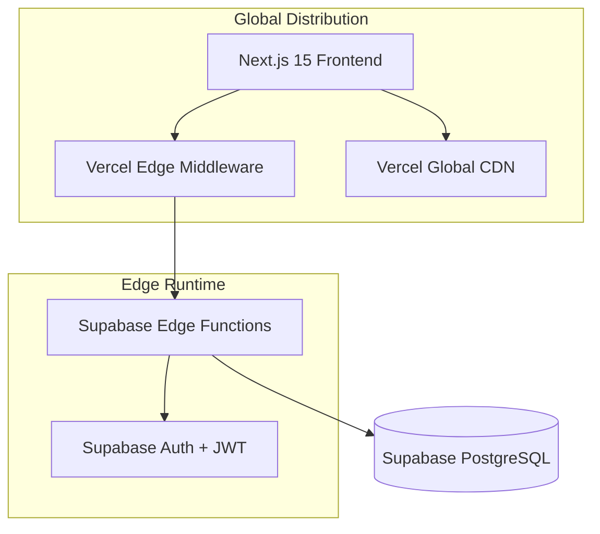

# R.W.S Blog System

<div align="center">


**Modern, Serverless Blog Platform with Edge-First Architecture**

[](https://nextjs.org/)
[](https://supabase.com/)
[](https://www.typescriptlang.org/)
[](https://tailwindcss.com/)
[](https://vercel.com/)

**🌐 Live Site: [https://rws-ruddy.vercel.app](https://rws-ruddy.vercel.app)**

</div>

## 🚀 Project Overview

R.W.S Blog System は現代的なサーバーレスブログプラットフォームで、**Supabase Functions 中心のアーキテクチャ**で構築されています。グローバルエッジデプロイメント、自動スケーリング、メンテナンスフリーのインフラストラクチャを提供し、データベースからUIまで完全な型安全性を実現しています。

### 🏗️ アーキテクチャ



**フロントエンド**: Next.js 15 + TypeScript + App Router + shadcn/ui  
**バックエンド**: Supabase Functions (Deno/TypeScript) + Edge Runtime  
**データベース**: Supabase PostgreSQL + リアルタイム機能  
**認証**: Supabase Auth + JWT トークン  
**デプロイ**: Vercel (フロントエンド) + Supabase (バックエンド・DB)  
**アーキテクチャ**: サーバーレス、エッジデプロイ、グローバル分散

## ✨ 主要機能

### 🔐 **エンタープライズグレードセキュリティ**
- Supabase Auth による JWT トークン認証
- 動的設定対応 Content Security Policy (CSP)
- Zod スキーマによる入力サニタイゼーション・XSS防止
- IP ベースレート制限
- Supabase クライアントによる SQL インジェクション防止
- Row Level Security (RLS) によるデータベースレベルセキュリティ
- Vercel ミドルウェアによるエッジレベルセキュリティ

### 📝 **コンテンツ管理**
- **パブリックインターフェース**: ホームページ、記事一覧、個別記事ページ、検索機能
- **管理ダッシュボード**: 記事の完全CRUD操作
- **リッチエディタ**: Markdown サポート + ライブプレビュー
- **下書きシステム**: 保存・公開ワークフロー
- **検索・フィルタ**: タイトル、本文、要約での複合検索
- **YouTube 統合**: 自動プレイ対応 iframe 埋め込み

### 🎨 **モダン UI/UX**
- Tailwind CSS による完全レスポンシブデザイン
- 🖥️ デスクトップ・📱 モバイル最適化済み管理画面
- Server Components による SEO 最適化
- Next.js Image による画像最適化
- shadcn/ui コンポーネントベースアーキテクチャ
- アクセシビリティ対応（label-input関連付け等）

### 🚀 **パフォーマンス・スケーラビリティ**
- Next.js App Router + Server Components
- 動的サイトマップ生成 (ISR対応)
- データベースクエリ最適化
- キャッシュ戦略による性能向上
- エッジファンクションデプロイ対応
- Core Web Vitals 最適化

## 📋 前提条件

- **Node.js**: v20.0.0 以上
- **Supabase CLI**: 最新版
- **Git**: 最新版

## 🛠️ インストール・セットアップ

### 1. リポジトリクローン

```bash
git clone https://github.com/your-username/RWS.git
cd RWS
```

### 2. フロントエンドセットアップ (Next.js)

```bash
cd frontend

# 依存関係インストール
npm install

# 環境変数ファイルコピー
cp .env.example .env.local

# 環境変数設定
# .env.local を編集してSupabase設定を追加
```

### 3. バックエンドセットアップ (Supabase Functions)

```bash
cd ../supabase

# Supabase プロジェクト初期化
npx supabase init

# ローカル Supabase 開始
npx supabase start

# Functions をローカルでサーブ
npx supabase functions serve
```

### 4. 環境変数設定

#### フロントエンド (.env.local)
```env
# Site Configuration
NEXT_PUBLIC_SITE_URL=https://rws-ruddy.vercel.app

# API Configuration
NEXT_PUBLIC_API_BASE_URL=/api

# Supabase Configuration
NEXT_PUBLIC_SUPABASE_URL=https://your-project-ref.supabase.co
NEXT_PUBLIC_SUPABASE_ANON_KEY=your_supabase_anon_key_here

# Service Role Key (for server-side operations)
SUPABASE_SERVICE_ROLE_KEY=your_supabase_service_role_key_here
```

#### バックエンド (Supabase Secrets)
```bash
# JWT Secret設定
npx supabase secrets set JWT_SECRET="your-jwt-secret"
```

## 🚀 開発ワークフロー

### 開発サーバー起動

```bash
# フロントエンド (ターミナル1)
cd frontend
npm run dev

# バックエンド (ターミナル2)
cd supabase
npx supabase start
npx supabase functions serve
```

### 📝 開発URL

- **フロントエンド**: http://localhost:3000
- **バックエンド API**: http://localhost:54321/functions/v1/api
- **管理ダッシュボード**: http://localhost:3000/admin/dashboard
- **Supabase Studio**: http://localhost:54323

### 🧪 テスト

#### フロントエンドテスト
```bash
cd frontend

# ユニットテスト
npm run test

# E2Eテスト
npm run test:e2e

# カバレッジレポート
npm run test:coverage

# E2Eテスト（ヘッド付き）
npm run test:e2e:headed
```

#### バックエンドテスト
```bash
cd supabase

# Functions のローカルテスト
npx supabase functions serve

# API ヘルスチェック
curl http://localhost:54321/functions/v1/api/health
```

### 🔍 コード品質

#### フロントエンド
```bash
cd frontend

# リンティング
npm run lint

# 型チェック
npm run type-check

# リンティング問題修正
npm run lint:fix

# ビルド
npm run build
```

#### バックエンド
```bash
cd supabase

# データベースリンティング
npx supabase db lint

# マイグレーション適用
npx supabase db push
```

## 📊 API ドキュメント

### 認証エンドポイント

| Method | Endpoint | Description | Auth Required |
|--------|----------|-------------|---------------|
| POST | `/api/login` | 管理者ログイン | No |
| POST | `/api/logout` | 管理者ログアウト | Yes |
| GET | `/api/user` | 現在のユーザー取得 | Yes |

### パブリック記事エンドポイント

| Method | Endpoint | Description | Auth Required |
|--------|----------|-------------|---------------|
| GET | `/api/posts` | 公開記事一覧取得 | No |
| GET | `/api/posts/{id}` | 記事詳細取得 | No |

### 管理記事エンドポイント

| Method | Endpoint | Description | Auth Required |
|--------|----------|-------------|---------------|
| GET | `/api/admin/posts` | 全記事一覧取得 | Yes |
| POST | `/api/admin/posts` | 新規記事作成 | Yes |
| GET | `/api/admin/posts/{id}` | 編集用記事取得 | Yes |
| PUT | `/api/admin/posts/{id}` | 記事更新 | Yes |
| DELETE | `/api/admin/posts/{id}` | 記事削除 | Yes |

### ユーティリティエンドポイント

| Method | Endpoint | Description | Auth Required |
|--------|----------|-------------|---------------|
| GET | `/api/health` | ヘルスチェック | No |

### 📋 リクエスト・レスポンス例

#### ログインリクエスト
```json
POST /api/login
{
  "email": "admin@rws.com",
  "password": "password123!!"
}
```

#### ログインレスポンス
```json
{
  "user": {
    "id": "admin-user-id",
    "name": "Kamura",
    "email": "admin@rws.com"
  },
  "access_token": "admin-token-xxx"
}
```

## 🌐 デプロイメント

### 本番デプロイ手順

#### 1. Supabase 設定

```bash
# Supabase プロジェクト作成・設定
npx supabase login
npx supabase init
npx supabase link --project-ref your-project-ref

# Functions デプロイ
npx supabase functions deploy api

# Secrets 設定
npx supabase secrets set JWT_SECRET="your-production-jwt-secret"
```

#### 2. Vercel デプロイ

```bash
# Vercel CLI インストール
npm i -g vercel

# フロントエンドデプロイ
cd frontend
vercel --prod
```

#### 3. 自動デプロイスクリプト使用

```bash
# 環境変数設定
export SUPABASE_URL="your-supabase-url"
export SUPABASE_ANON_KEY="your-anon-key"
export SUPABASE_SERVICE_ROLE_KEY="your-service-role-key"
export JWT_SECRET="your-jwt-secret"

# デプロイ実行
./scripts/deploy.sh
```

### 🔧 本番環境設定

#### 環境変数 (本番)
```env
# Vercel Environment Variables
NEXT_PUBLIC_SITE_URL=https://rws-ruddy.vercel.app
NEXT_PUBLIC_API_BASE_URL=/api
NEXT_PUBLIC_SUPABASE_URL=https://your-project-ref.supabase.co
NEXT_PUBLIC_SUPABASE_ANON_KEY=your_production_anon_key
SUPABASE_SERVICE_ROLE_KEY=your_production_service_role_key
```

#### セキュリティチェックリスト
- [x] 管理者認証情報設定済み（admin@rws.com）
- [x] CORS 本番ドメイン設定済み
- [x] SSL/TLS 証明書設定済み（Vercel自動）
- [x] レート制限設定済み
- [x] Row Level Security (RLS) 有効化済み
- [x] セキュリティヘッダー設定済み
- [x] Content Security Policy 設定済み

## 🏗️ プロジェクト構造

```
RWS/
├── 📁 frontend/                # Next.js フロントエンド
│   ├── 📁 app/                 # App Router
│   │   ├── 📁 admin/           # 管理ダッシュボード
│   │   ├── 📁 info/            # 記事詳細ページ
│   │   ├── 📁 news/            # ニュース一覧ページ
│   │   ├── 📄 sitemap.ts       # 動的サイトマップ
│   │   ├── 📄 robots.ts        # robots.txt
│   │   └── 📄 page.tsx         # ホームページ
│   ├── 📁 components/          # React コンポーネント
│   │   ├── 📁 admin/           # 管理画面コンポーネント
│   │   ├── 📁 common/          # 共通コンポーネント
│   │   ├── 📁 posts/           # 記事コンポーネント
│   │   └── 📁 ui/              # shadcn/ui コンポーネント
│   ├── 📁 hooks/               # カスタム React フック
│   ├── 📁 lib/                 # ユーティリティ・API クライアント
│   ├── 📁 types/               # TypeScript 型定義
│   ├── 📁 tests/               # フロントエンドテスト
│   ├── 📄 middleware.ts        # Vercel ミドルウェア
│   └── 📄 vercel.json          # Vercel 設定
├── 📁 supabase/                # Supabase 設定
│   ├── 📁 functions/           # Edge Functions
│   │   └── 📁 api/             # メイン API ハンドラー
│   ├── 📁 migrations/          # データベースマイグレーション
│   └── 📄 config.toml          # Supabase 設定
└── 📁 scripts/                 # デプロイ・ユーティリティスクリプト
```

## 📚 技術スタック

### フロントエンド技術
- **Next.js 15**: App Router による React フレームワーク
- **TypeScript**: 型安全な開発
- **Tailwind CSS**: ユーティリティファースト CSS フレームワーク
- **shadcn/ui**: モダン UI コンポーネントライブラリ
- **Zod**: ランタイム型バリデーション
- **React Hook Form**: フォーム処理
- **Axios**: HTTP クライアント

### バックエンド技術
- **Supabase Functions**: Deno/TypeScript エッジファンクション
- **Supabase Auth**: JWT トークン認証
- **Supabase Database**: PostgreSQL + リアルタイム機能
- **Row Level Security**: データベースレベルセキュリティ

### DevOps・ツール
- **Vercel**: フロントエンドデプロイメント
- **Supabase**: Backend as a Service
- **GitHub Actions**: CI/CD パイプライン
- **ESLint/Prettier**: コード品質
- **Playwright**: E2E テスト
- **Jest**: ユニットテスト

## 🔒 セキュリティ機能

### 認証・認可
- Supabase Auth による JWT トークン
- Row Level Security (RLS) ポリシー
- CSRF 保護
- セキュアセッション管理

### 入力バリデーション・サニタイゼーション
- Zod スキーマによるバリデーション
- XSS 防止（適切なエスケープ処理）
- SQL インジェクション防止（Supabase クライアント）
- レート制限実装

### セキュリティヘッダー・ポリシー
- Content Security Policy (CSP)
- HTTP セキュリティヘッダー
- CORS 設定
- Permissions Policy（YouTube autoplay対応）

## 🚨 トラブルシューティング

### よくある開発時の問題

#### 1. CORS エラー
```bash
# Vercel ミドルウェアの CORS 設定を確認
# frontend/middleware.ts の allowedOrigins を確認
```

#### 2. 認証問題
```bash
# 環境変数確認
echo $NEXT_PUBLIC_SUPABASE_URL
echo $NEXT_PUBLIC_SUPABASE_ANON_KEY

# Supabase プロジェクト接続確認
npx supabase status
```

#### 3. データベース接続エラー
```bash
# ローカル Supabase 起動
npx supabase start

# RLS ポリシー確認
npx supabase db lint
```

#### 4. フロントエンドビルドエラー
```bash
# Next.js キャッシュクリア
rm -rf .next

# 依存関係再インストール
rm -rf node_modules package-lock.json
npm install
```

### パフォーマンス最適化

#### フロントエンド最適化
```bash
# バンドルサイズ分析
npm run build

# 型チェック
npm run type-check

# 未使用インポート削除
npm run lint:fix
```

#### バックエンド最適化
```bash
# RLS ポリシー最適化
./scripts/optimize-rls.sh

# データベース最適化
npx supabase db push
```

## 📈 監視・アナリティクス

### ヘルスチェック
- API ヘルスエンドポイント: `/api/health`
- データベース接続監視
- サービス可用性追跡

### パフォーマンス指標
- API レスポンス時間
- データベースクエリパフォーマンス
- フロントエンドレンダリング指標
- Core Web Vitals 追跡

## 📊 本番環境ステータス

### ✅ 実装済み機能
- 完全レスポンシブデザイン（デスクトップ・モバイル）
- 管理ダッシュボード（記事CRUD操作）
- YouTube 動画埋め込み対応
- 動的サイトマップ生成
- SEO 最適化
- セキュリティヘッダー設定
- レート制限実装
- Row Level Security (RLS) 有効化

### ⚠️ 最適化推奨事項
- RLS ポリシーパフォーマンス最適化
- 未使用インポート削除（94件のESLintエラー）
- 本番ログ監視サービス統合
- Google Analytics 設定

### 🔧 管理者情報
- **管理者メール**: admin@rws.com
- **認証方式**: カスタム JWT トークン
- **管理ダッシュボード**: https://rws-ruddy.vercel.app/admin/dashboard

## 🤝 コントリビューション

### 開発ガイドライン
1. 既存のコードスタイル・パターンに従う
2. 新機能には包括的なテストを記述
3. API 変更時はドキュメントを更新
4. 従来のコミットメッセージを使用
5. 新規開発は機能ブランチで実施

### コード品質基準
- **フロントエンド**: ESLint + Prettier 設定
- **バックエンド**: TypeScript strict モード
- **テスト**: 最低80%のコードカバレッジ
- **TypeScript**: strict モード有効化

## 📞 サポート・連絡先

### 開発チーム
- **作成者**: Kamura
- **フロントエンド**: Next.js + TypeScript
- **バックエンド**: Supabase Functions + PostgreSQL
- **DevOps**: Vercel + Supabase

### ヘルプを得る
- GitHub で Issue を作成
- トラブルシューティングセクションを確認
- API ドキュメントを参照

## 📄 ライセンス

このプロジェクトは MIT ライセンスの下でライセンスされています。詳細は [LICENSE](LICENSE) ファイルを参照してください。

## 🙏 謝辞

- [Next.js](https://nextjs.org/) - React フレームワーク
- [Supabase](https://supabase.com/) - Backend as a Service
- [Vercel](https://vercel.com/) - フロントエンドデプロイメント
- [shadcn/ui](https://ui.shadcn.com/) - UI コンポーネント
- [Tailwind CSS](https://tailwindcss.com/) - CSS フレームワーク

---

<div align="center">

**モダンウェブのために ❤️ で構築**

[](LICENSE)
[](CONTRIBUTING.md)

</div>